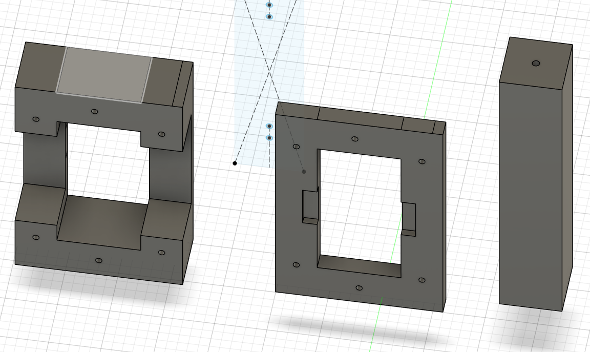
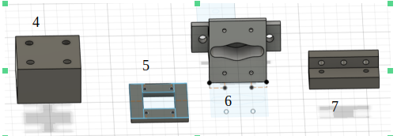
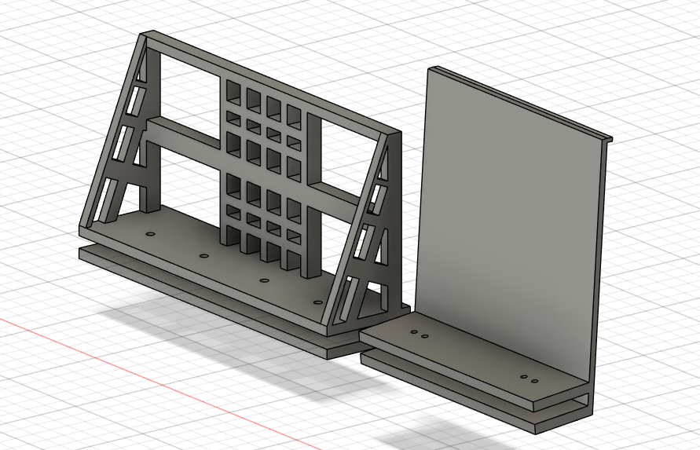

/break
# 7. Umsetzung
## 7.1 Konstruktion

1. Basis  der Reglerhalterung: Verschraubt mit Plexiglasscheibe
2. Aufsatz Reglerfassung, zusammen mit 1 verschraubt 
3. Stütze (5 mal) zwischen den beiden Plexilgasscheiben: Gehalten von jeweils einer unteren und einer oberen Schraube

4. Abstandshalter für die Stützenrollen: Verschraubt mit Plexiglasscheiben
5. Obige Reglerhalterung für den Reglerarm: Wird mit 6 verschraubt
6. Untere Reglerhalterung für den Reglerarm mit Fassung für den Reglerarm
7. Motorung: die oberen Löcher sind für die Verschraubung für die Verschraubung an der Plexiglasscheibe, die unteren befestigen den Motor

8. Handyhalterung: Allgemeine Halterung für verschiedene Handytypen, die unteren Schrauben sorgen für die Befestigung der an der Plexiglascheibe
9. Solarzellenhalterung (10 mal) für die Befestigung der Solarzellen, über die Löcher und die Aussparung an der Plexiglasscheibe befestigt

## 7.2 Verkabelung und Schaltung

Es wurden insgesamt 20 Solarzellen auf auf der Oberseite und den seitlichen Halterungen platziert. Verwendet wurden VIKOCELL 2.8 W Zellen (125 mm * 125 mm). Die maximale Spannung der Zellen liegt bei 0,5V so dass um eine Spannung zu erzeugen, die zum Laden zumindest einer Powerbank hätte verwendet werden können mindestens 10 in Serie geschaltet hätten werden müssen. Da dies die Schaltung maßgeblich verkompliziert hätte, wurde entschieden, die Zellen nur zum Messen zu verwenden, so kann auch jeweils die Leerlaufspannung des Moduls verwendet werden. Bei den seitlichen Anordnungen wurden jeweils 3 Module in Serie geschaltet, auf der Oberseite jeweils 3 in Serie und zwei der Serienschaltungen parallel. An der Front wurden zwei Zellen parallel geschaltet. Diese sind direkt mit ADC (Analog-Digital-Converter) Eingängen des ESP32 verbunden, der so die Spannung der Module ermitteln kann. Die ADCs des ESP32 haben ca. 4100 Abstufungen von 0 V – 3.3 V, so dass die in Serie geschalteten Module im IdeaLfall etwa die Hälfte des Messbereichs umfassen.  

Die Verarbeitung der Solarzellen erweiste sich als unerwartete Schwierigkeit, nach Herstellerangaben haben die Solarzellen eine Dicke von ca. 160 µm (etwas dicker als ein menschliches Haar), sind nicht flexibel und mechanisch nicht nicht belastbar.  

Die Kontaktierung erfolgt über sogenannte Base Tapes, die lotfrei auf beiden Seiten der Zelle aufgebracht werden.

## 7.3 Codebeschreibung des Antriebs

Der Arduino-Code dient der Ansteuerung der Motoren und des Reglers. Mithilfe der Bibliothek SoftwareSerial wird eine zusätzliche serielle Schnittstelle definiert, die unabhängig von der standardmäßigen seriellen Debugschnittstelle arbeitet, um die vom ESP32 empfangenen Steuerdaten zu verarbeiten.  

### Arduino

#### Setup:

Im Setup-Teil des Arduino-Codes werden beide seriellen Schnittstellen aktiviert und die entsprechenden Pins für die Motoren und den Regler definiert. Dabei erhalten die Motoren entgegengesetzte Richtungen, da beide dasselbe Rad antreiben, jedoch von verschiedenen Seiten aus. Zudem wird die Funktion parseMessage implementiert, die die vom ESP32 empfangenen Daten in die lokalen Variablen für Geschwindigkeit und Winkel speichert.  

#### Loop:

Im Loop-Teil des Codes wird kontinuierlich nach neuen Paketen vom ESP32 gesucht, die Steuerungsinformationen enthalten. Diese Informationen werden dann mittels der parseMessage-Funktion in den entsprechenden Variablen gespeichert. Falls ein übermittelter Wert zu hoch ist, wird er auf den vordefinierten Maximalwert für die Geschwindigkeit begrenzt.  

Anschließend wird der übermittelte Geschwindigkeitswert durch den Umfang des angetriebenen Rades in Metern geteilt, um die Umdrehungen pro Sekunde zu berechnen. Die berechnete Anzahl der Schritte pro Sekunde wird mit der Anzahl der Schritte multipliziert, die für eine vollständige Umdrehung benötigt werden. Danach wird die tatsächliche Motorgeschwindigkeit in Mikrosekunden pro Schritt berechnet. Dieser Wert wird dann über die entsprechenden Pins an die Motoren weitergegeben.  

### ESP32

Im ESP32-Code werden zunächst die konstanten Netzwerkdaten und die Pins für die Solarzellen definiert. Anschließend werden Variablen für die Geschwindigkeit, den Winkel und die Durchschnittsspannungen der Solarzellen festgelegt. Außerdem wird die serielle Schnittstelle für die Kommunikation mit dem Arduino eingerichtet.  

#### Setup:

Im Setup-Teil des Codes wird die serielle Kommunikation gestartet und das Netzwerk mitsamt dem UDP-Port, der für die Kommunikation mit der Android-App vorgesehen ist, eingerichtet.

#### Loop:

Zu Beginn der Hauptschleife (Loop) werden die Durchschnittswerte der von den Solarzellen erhaltenen Spannungen auf null zurückgesetzt. Ein Timer wird gestartet, der eine Funktion auslöst, falls der Roboter sich länger als 30 Sekunden nicht bewegt hat. Diese Funktion richtet den Roboter erneut aus, basierend auf den Durchschnittswerten der Spannungen, sodass die vorderen Solarzellen die meiste Energie erhalten. 

Die Funktion zur Mittelung der Spannungen sammelt zehn Wertepaare und berechnet daraus den Durchschnittswert der Spannung jeder Solarzelle, um das mögliche Rauschen der Messwerte zu minimieren. Dadurch wird sichergestellt, dass die Kamera des Smartphones in Richtung der stärksten Lichtquelle zeigt. Der Timer wird dann zurückgesetzt, um die Ausrichtung basierend auf den neuen Werten fortzusetzen.  

Der ESP32 sucht nach eingehenden UDP-Paketen, die einen String mit Geschwindigkeit und Winkel enthalten. Dieser String wird in die lokalen Variablen gespeichert und anschließend über die serielle Schnittstelle an den Arduino gesendet. Dies sind die Steuerinformationen, die vom Handy kommen.  

### Android-App

Die **SunSeekerApp** ist eine in Kivy entwickelte Anwendung, die Bildverarbeitung und Netzwerkommunikation kombiniert. Die Aufgabe der Anwendung besteht darin, Helligkeitsdaten und Richtungshinweise von Kameraaufnahmen zu verarbeiten und diese Informationen zu übertragen.  

Sobald die Bilderkennung eine Richtung ermittelt hat, soll das Fahrzeug sich dorthin bewegen.  

Jeder Bewegungsvorgang soll eine Richtung [in ° ] und eine Geschwindigkeit [u/s], also die wie viele Umdrehungen des Rades pro Sekunde, ausführen.  

: Drei Bewegungsoperatoren

|  Richtung Alpha [°]  | Antrieb Velocity [u/s]  |
|----------------|-------------------|
|         0      |         2         |
|         90     |         2         |
|         270    |         4         |

Der Roboter kann sich z.B. zuerst auf der Stelle drehen und danach ein Stück fahren.

Die Bilderkennung wird kontinnuierlich ausgeführt.
Je näher der Roboter der Lichtfläche kommt, desto größer wird diese, und desto langsamer wird er (und desto glchlicher wird er).

#### `main.py`
Kernlogik der Anwendung. In der Klasse `MyRoot`, wird die Benutzeroberfläche sowie die Methoden zur Datenverarbeitung und -übertragung implementiert.

##### Klasse: `MyRoot`

- **Attribute:**
  - `display_emotion`: Anzeigeelement für Emotionen.
  - `display_direction`: Anzeigeelement für Richtungen.
  - `image_display`: Anzeigeelement für das verarbeitete Bild.
  - `camera_display`: Anzeigeelement für den Kamerafeed.
  - `current_camera_index`: Index zur Auswahl der Kamera.
  - `happyness_threshold`: Schwellenwert für die Helligkeit, um positive Emotionen anzuzeigen.

- **Methoden:**
  - `__init__(self, **kwargs)`

  - `acquire_wake_lock(self)`

  - `get_internal_storage_path(self)`

  - `create_folder_click(self)`
  
  - `create_textfile_click(self)`

  - `create_processing_file(self)`

  - `show_textfile_click(self)`: Zeigt den Inhalt der Datei `send_packages.txt` in einem Popup an.

  - `show_processing_file_click(self)`: Anzeige von `processing.txt`, auch im Popup.

  - `set_emotionnumber(self, relative_brightness)`: Aktualisiert das Smiley.

  - `set_directionnumber(self, normalized_center_x)`: Aktualisiert den Richtungspfeil.

  - `save_transmission_data(self, relative_brightness, normalized_center_x)`

  - `send_velocity_and_alpha(self, velocity, alpha)`: Sendet die Bewegungsdaten über UDP.

  - `get_max_brightness(self)`: Liest den höchsten Wert, der in der Datei `processing.txt` unter Helligkeit gespeichert ist, limitiert auf 100.

  - `map_brightness_to_velocity(self, brightness, max_brightness)`: Mappt die Helligkeit auf einen Geschwindigkeitswert zwischen 0.0 und 0.175.

  - `map_alpha(self, normalized_center_x)`: Mappt wo der helle Bereich ist auf einen Alpha-Wert zwischen 0 und 360 Grad.

  - `on_orientation(self, instance, width, height)`: Passt die Orientierung des Layouts basierend auf der Bildschirmausrichtung an.

  - `update(self, dt)`: Aktualisiert die Anzeige und verarbeitet das Kamerabild jede Sekunde.
    

#### Bildverarbeitung (`spotcam.py`)

Die Klasse `SpotCam` ist für die Bildverarbeitung zuständig. Sie analysiert das Kamerabild, um helle Bereiche zu identifizieren und deren Position und Größe zu bestimmen.

##### Klasse: `SpotCam`

- **Methoden:**
  - `process_image(self, img)`: Konvertiert das Bild in Graustufen, identifiziert helle Bereiche und berechnet deren Helligkeit, Position und Größe.

#### Netzwerkommunikation (`transceiver.py`)

Die Klasse `UDPTransceiver` ist für die UDP-Kommunikation zuständig.

##### Klasse: `UDPTransceiver`

- **Methoden:**

  - `__init__(self)`: 
  - `send_data(self, data)`: Sendet die Daten über UDP.

#### Benutzeroberfläche (`sunseeker.kv`)

Die Datei `sunseeker.kv` definiert das Layout der Benutzeroberfläche.

##### Hauptkomponenten:

- `Label`: Zeigt statischen Text an.
- `Widget`: Dient als Trennelement zwischen anderen UI-Komponenten.
- `Camera`: Zeigt den Kamerafeed an.
- `Image`: Zeigt das verarbeitete Bild an.
- `Button`: Verschiedene Schaltflächen für die Anzeige von Datei-Inhalten, Umschalten der Kamera und Vollbildanzeige der Emotionen.

#### Installation und Ausführung

Um die Anwendung auf einem Android-Gerät auszuführen, wird `buildozer` verwendet, um die App zu paketieren und zu installieren. Folgende Schritte sind erforderlich: 
Die Entwicklungsumgebung um für mobile Anwendungen: Kivy @Kivy  
Zur Bilderkennung wird OpenCV verwendet. @OpenCV  
Als Compiler wird benutzt: Buildozer @Buildozer  

